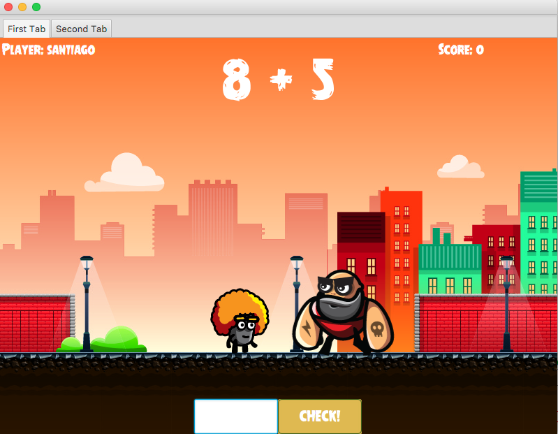

# Punch Math 

This is an attempt of a math game for primary school children. It has a very good start using Java design patterns. However, it seems a little bit clumsy and it will be good to improve by changing the way the player destroys its enemies.

# How to Play
- Type the result and select check
- Press p to punch the bad guys 

